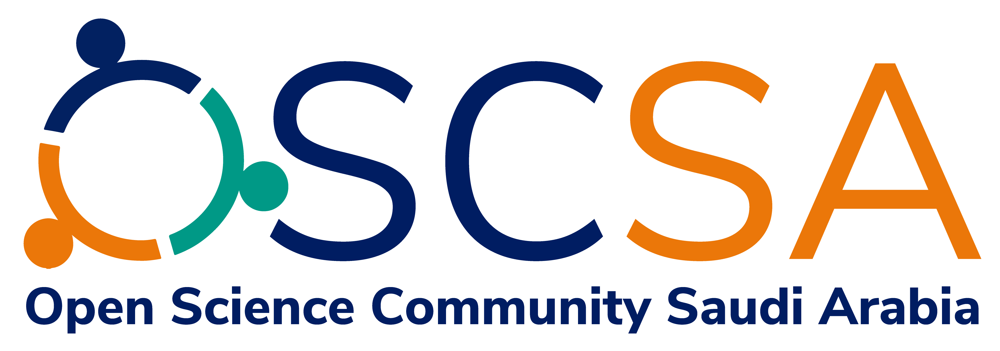
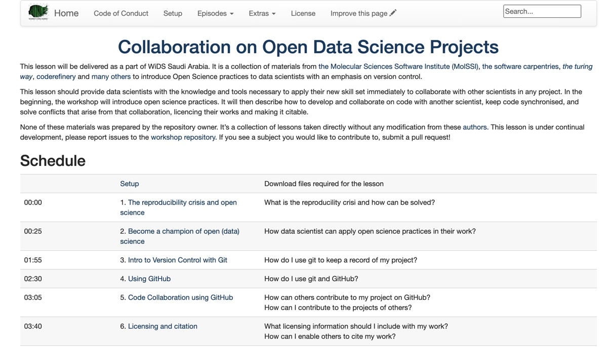
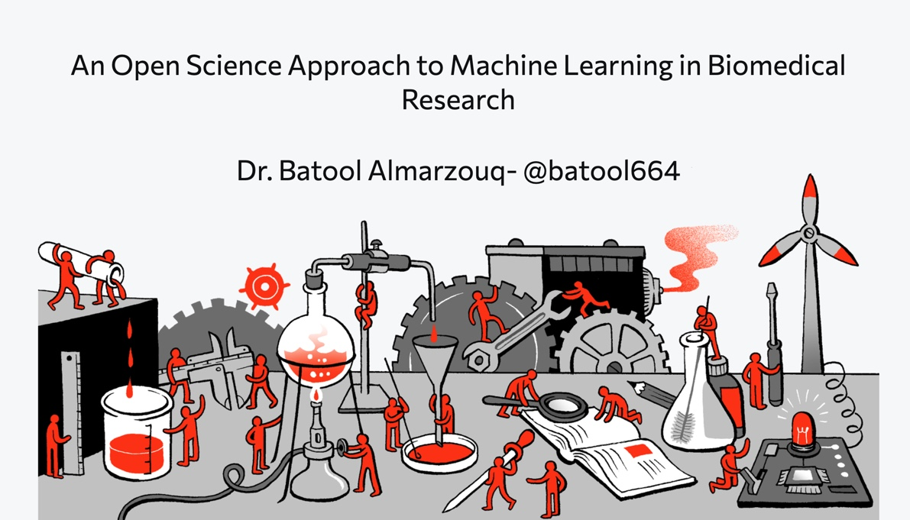

```{r setup, include=FALSE}
options(htmltools.dir.version = FALSE, servr.interval = 0.05)
knitr::opts_chunk$set(collapse = TRUE, fig.retina = 3)
library(xaringanExtra)
library(xaringan)
```


```{r share-again, echo=FALSE}
xaringanExtra::use_share_again()
xaringanExtra::use_tachyons()
```

class: title-slide, center, top
background-image: url(figs/landing11.jpg)
background-size: contain
background-size: 50%
background-position: bottom
background-color: #FFFFFF


#### `r rmarkdown::metadata$title`

##### `r rmarkdown::metadata$subtitle`

##### `r rmarkdown::metadata$author`

---

class: center, middle
#### What is Open Science?
.bg-washed-blue.b--light-blue.ba.bw2.br3.shadow-5.ph4.mt5[
In a nutshell, Open Science describes an on-going movement in the way research is performed, researchers collaborate, knowledge is shared, and science is organised. It affects the whole research cycle and its stakeholders, enhances science by facilitating more transparency, openness, networking and collaboration.

.tr[
— OpenAIRE
]]

---
class: center
background-image: url(figs/Open_science_taxonomy.png)
background-size: contain
background-position: center

.left[.footnote[The image is taken from "Pontika et al (2015). Fostering Open Science to Research using a Taxonomy and an eLearning Portal. In: iKnow: 15th International Conference on Knowledge Technologies and Data Driven Business, 21-22 Oct 2015, Graz, Austria. DOI: https://doi.org/10.1145/2809563.2809571"]]
---
class: center, middle
background-image: url(figs/reproducibility-circle2.png)
background-size: 75%
background-color: #f3f3f3

class: top
#### Open Science aims to fix the "Reproducibility Crisis" in Science

.footnote[Credit: Key results of the survey on reproducibility conducted by [Nature in 2016](https://www.nature.com/news/1-500-scientists-lift-the-lid-on-reproducibility-1.19970)]

---
class: center, middle, inverse
###### After the pandemic, 193 countries gathered in Paris for the 40th session of the UNESCO's General Conference and decided to embark on a new global normative instrument on Open Science. It's referred to as the "UNESCO Recommendation on Open Science". 

.left[.footnote[Credit: [UNESCO Takes the Lead in Developing a New Global Standard-setting Instrument on Open Science](https://en.unesco.org/news/unesco-takes-lead-developing-new-global-standard-setting-instrument-open-science)]]
--

###### This process is expected to lead to the adoption of the recommendation by UNESCO Member States in 2021. 


---

class: center, middle, inverse

###### Therefore, there is an increasing number of Open Science Communities in Europe

--

###### A vast network of Open Science Communities is in the Netherlands, Sweden, Germany, UK and many other countries ...

--

###### BUT Open Science movement is not yet adopted in the Middle East


---

class: center, middle, inverse
###### In 2021, We started an Open Science Community in Saudi Arabia

--

###### We are in the process of re-designing Open Science for Saudi Arabia to potentially be adopted by the other countries in the Middle East

--

###### The Open Science Community in Saudi Arabia aims to create significant value towards Saudi Arabia's Vision 2030, that focus on enhancing knowledge and improving equal access to education in the Kingdom



---

class: center, middle, inverse

###### The Open Science Community in Saudi Arabia is supported by [Open Life Science Programme](https://openlifesci.org/)

###### Led by Batool Almarzouq, Anelda Van der Walt and Paula Moraga


---
class: center, middle

#### Our Vision statement 

.bg-washed-blue.b--light-blue.ba.bw2.br3.shadow-5.ph4.mt5[
We want to create a space in Saudi Arabia where newcomers and seasoned peers can connect, inspire each other, and provide input on policies and infrastructures. Working together to make Open Science the norme. So, we are calling out to researchers and colleagues in Saudi Arabia

.tr[
— The Open Science community in Saudi Arabia 
]]

.left[.footnote["The vision is largely inspired by the the vision of the International Network of Open Science Communities (INOSC)"]]
---
class: center, middle
background-color: #FFFFFF


---
class: center, middle, inverse

## Examples of our activities in Feb 2021

###### - A workshop in Women in Data Science (WiDS2021) in Saudi Arabia, under the title ["Collaborating on Open Data Science Projects"](https://batoolmm.github.io/Collaborating-on-Open-Data-Science-Projects/)




.left[.footnote[All of our work is citable and available in [Zenodo](https://zenodo.org/communities/1231231664/?page=1&size=20)and GitHub]]
---

class: center, middle, inverse
## Examples of our activities in Feb 2021

###### - A talk titled ["An Open Science Approach to Machine Learning in Biomedical Research"](https://saudi-data-community.netlify.app/#1) in the Saudi Data Community.



.left[.footnote[All of our work is citable and available in [Zenodo](https://zenodo.org/communities/1231231664/?page=1&size=20) and GitHub]]


---
class: center, middle, inverse

## Are you a researcher from the Middle East?

--

## Or anywhere in the globe!

--

## Are you an advocate for Open Science?

--

## Or just want to learn more!

--

Come and join me for informal Chat on every last Friday each month at 2:00pm UTC

Zoom link: https://liverpool-ac-uk.zoom.us/j/91493007481?pwd=UHlJc2swTnBqdU0rT0tjN3c0aC9SUT09, Passcode: @YEAR2021

---


class: middle
## Further References:

##### - [Redesign open science for Asia, Africa and Latin America](https://www.nature.com/articles/d41586-020-03052-3)

##### - [UNESCO Takes the Lead in Developing a New Global Standard-setting Instrument on Open Science](https://en.unesco.org/news/unesco-takes-lead-developing-new-global-standard-setting-instrument-open-science)

##### - [The Turing Way: A guide to reproducible and collaborative data science](https://the-turing-way.netlify.app/welcome.html)

##### - [EC policies and mandates on Open Access to publications and research data,  FAIR data](https://www.openaire.eu/ec-policies-and-mandates)
---

class: middle, center, inverse

## Thank you so much for reaching the end!

###### Contact: Batool Almarzouq
###### Email: batool@liverpool.ac.uk, Twitter: @batool664
###### The source code for these the slides is [available on GitHub](https://github.com/BatoolMM/Open-Education-Week-2021)


```{r include=FALSE}
pagedown::chrome_print("index.html",output="index.pdf")

```

